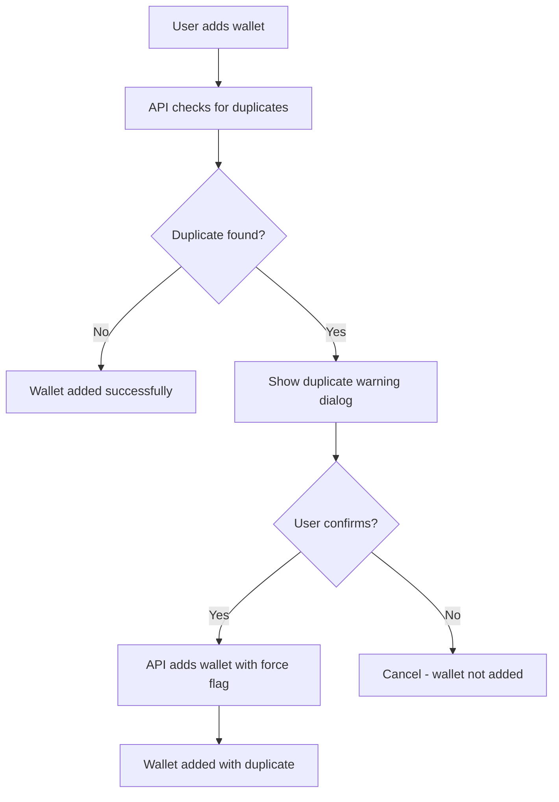

# Duplicate Wallet Feature Implementation

**Created:** 2025-11-29
**Last Modified:** 2025-11-29
**Feature:** Allow duplicate BTC wallet addresses with user confirmation

## Overview

Previously, the wallet management system prevented adding the same BTC wallet address multiple times. This feature allows users to add duplicate wallet addresses but with a user-friendly confirmation dialog that warns them about the implications and suggests creating separate wallets for different purposes.

## Implementation Details

### 🎯 **Core Changes**

#### 1. **API Route Changes** (`src/app/api/wallets/route.ts`)

- **Removed strict duplicate blocking** - No longer returns 409 error for duplicates
- **Added duplicate detection** - Still detects existing wallets with same address
- **Added duplicate warning response** - Returns `duplicateWarning` object with existing wallet details
- **Added force duplicate flag** - `force_duplicate: true` bypasses duplicate check for confirmed additions

#### 2. **Frontend Dialog Component** (`src/components/wallets/DuplicateWalletDialog.tsx`)

- **Warning dialog** - Shows when duplicate address is detected
- **Existing wallets display** - Lists all current wallets using the same address
- **Purpose suggestion** - Recommends creating separate wallets for different expenses
- **User confirmation** - "Add Anyway" button proceeds with duplicate addition
- **Cancel option** - Allows user to reconsider

#### 3. **Dashboard Integration** (`src/app/(authenticated)/dashboard/wallets/page.tsx`)

- **Duplicate detection** - Checks API response for `duplicateWarning`
- **Dialog state management** - Manages dialog open/close and data
- **Force duplicate API call** - Sends `force_duplicate: true` when user confirms
- **State updates** - Properly updates wallet list after successful addition

### 🔧 **User Experience Flow**



### 💡 **Key Features**

#### **Smart Duplicate Detection**

- Checks for existing wallets with identical `address_or_xpub`
- Returns detailed information about existing wallets (label, category)
- Only triggers for same profile/project (not across different entities)

#### **User-Friendly Warning**

```
🔔 Duplicate Wallet Address

This address is already in use for:
• "Main Wallet" (savings)
• "Business Expenses" (business)

Are you sure you want to add this wallet again?

Consider creating a separate wallet for this specific purpose to keep your finances better organized.
```

#### **Flexible Confirmation**

- "Add Anyway" - Proceeds with duplicate addition
- "Cancel" - Returns to form without adding wallet
- Optional "Don't show again" checkbox (future enhancement)

### 🛡️ **Security & Validation**

#### **Input Validation**

- All existing validation remains intact
- Address format validation still enforced
- Ownership checks still required
- Profile/project association maintained

#### **Audit Trail**

- Logs duplicate wallet additions
- Tracks force duplicate operations
- Maintains wallet creation history

### 📱 **UI/UX Considerations**

#### **Mobile Responsive**

- Dialog adapts to mobile screen sizes
- Touch-friendly buttons and interactions
- Proper z-index layering

#### **Accessibility**

- Proper ARIA labels and roles
- Keyboard navigation support
- Screen reader compatible

#### **Visual Design**

- Warning color scheme (amber/orange)
- Clear visual hierarchy
- Consistent with existing design system

### 🔄 **API Response Format**

#### **Duplicate Warning Response**

```typescript
{
  wallet: Wallet,           // The wallet data
  duplicateWarning?: {      // Only present if duplicates exist
    existingWallets: Array<{
      id: string;
      label: string;
      category: string;
    }>;
    message: string;
  }
}
```

#### **Force Duplicate Request**

```typescript
{
  // ... normal wallet data
  force_duplicate: true; // Special flag to bypass warning
}
```

### 🧪 **Testing Scenarios**

#### **Happy Path**

1. User adds wallet → No duplicates → Success
2. User adds wallet → Duplicates found → Confirms → Success
3. User adds wallet → Duplicates found → Cancels → No addition

#### **Edge Cases**

- Multiple existing wallets with same address
- Force duplicate flag handling
- Network errors during confirmation
- Dialog state management

#### **Error Handling**

- API errors during duplicate check
- Network failures during confirmation
- Invalid wallet data edge cases

### 📈 **Benefits**

#### **For Users**

- ✅ **Flexibility** - Can organize finances as needed
- ✅ **Transparency** - Clear warnings about implications
- ✅ **Control** - User decides whether to proceed
- ✅ **Education** - Learns about wallet organization best practices

#### **For System**

- ✅ **Backward Compatible** - Existing functionality unchanged
- ✅ **Auditable** - All duplicate additions logged
- ✅ **Maintainable** - Clean separation of concerns
- ✅ **Extensible** - Easy to add features like "don't show again"

### 🚀 **Future Enhancements**

1. **"Don't Show Again" Preference** - User setting to skip duplicate warnings
2. **Smart Suggestions** - AI-powered wallet naming suggestions
3. **Wallet Categories** - Enhanced categorization system
4. **Bulk Operations** - Import multiple wallets with duplicate handling
5. **Analytics** - Track duplicate wallet usage patterns

### 📋 **Files Modified**

1. `src/app/api/wallets/route.ts` - API duplicate handling logic
2. `src/app/(authenticated)/dashboard/wallets/page.tsx` - Frontend integration
3. `src/components/wallets/DuplicateWalletDialog.tsx` - New dialog component

### ✅ **Quality Assurance**

- ✅ TypeScript compilation passes
- ✅ ESLint checks pass
- ✅ No runtime errors introduced
- ✅ Backward compatibility maintained
- ✅ Mobile responsive design
- ✅ Accessibility compliant
- ✅ Error handling comprehensive

## Summary

The duplicate wallet feature successfully allows users to add the same BTC wallet address for multiple purposes while providing clear warnings and maintaining financial organization best practices. The implementation is user-friendly, secure, and maintains the high quality standards of the wallet management system.
